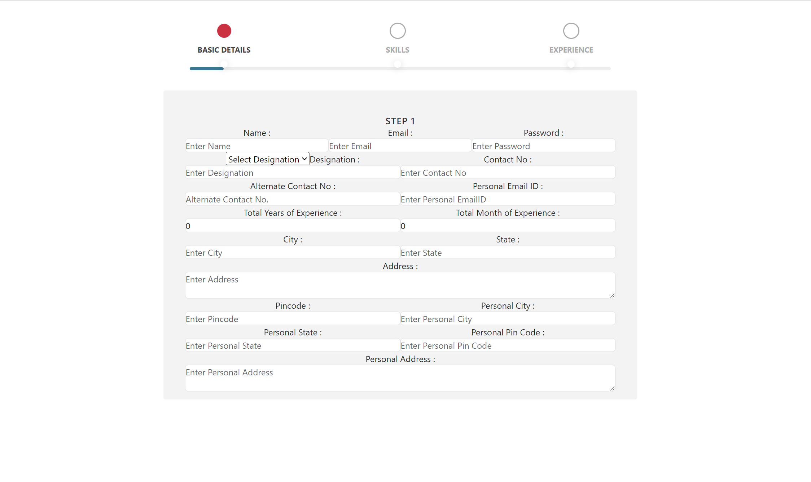

# EmployeeRegistrationApp

- This project is an employee registration page application and it is made with the intention of learning Angular.

## How to check via  server

- You can run `ng serve` on the terminal and go to `http://localhost:4200/` 

## How to clone this repository?

- You can use the this command link for cloning the project files to your computer:

   git clone https://github.com/ipekyilmaz35/Employee-registration-app-with-Angular.git

## Sample Screen Appearance

